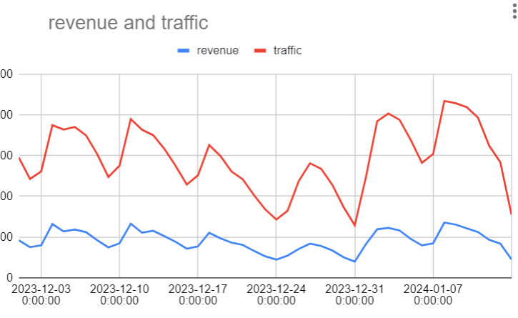
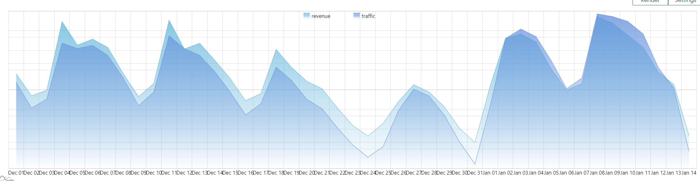
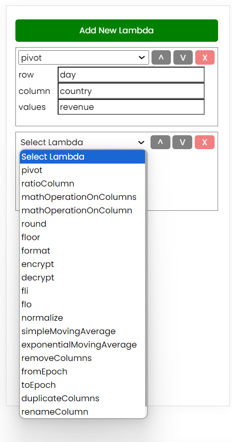
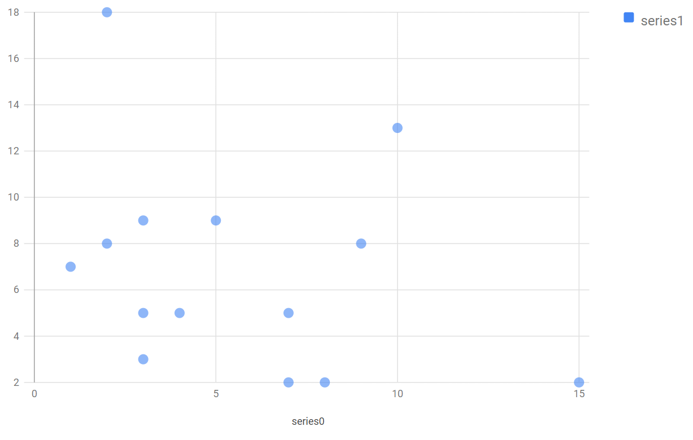
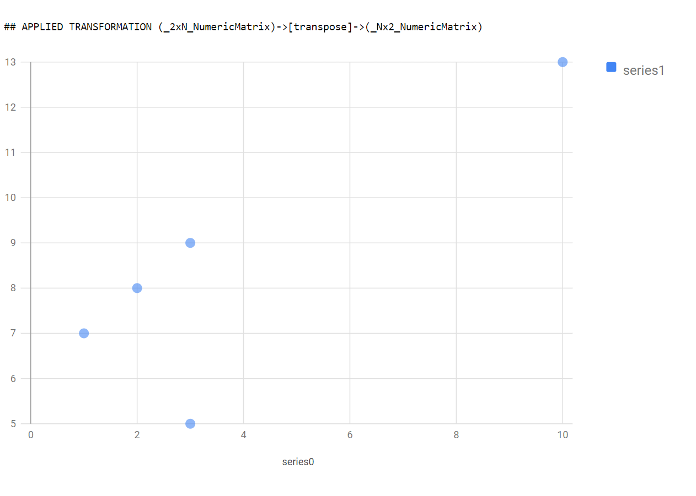

# Auto EDA

Auto Exploratory Analysis

Pass in some data, magically get details about the data as well as suggestions for how to transform it & plot it.

**Goal:**
- Make a tool to help non-professional data analysts understand their data by suggesting patterns used by professional analysis. 

---


## Important Note:
- This code is WIP, it is actively being worked on, has a lot of issues, and should not be forked / used
- I am keeping things hacky & dirty. I am aware of the inefficiencies / dumb shit, I am ignoring them for now 
- **I am not taking suggestions** / ideas. I've had this in mind for years, and im 99.999% confident I'll pull this off.
  - I don't want ideas because I don't want to have to give credit 
  - Once I finish everything I want to do and get stuck somewhere, I'll be open for ideas which I will happily credit people with :)
- I will be adding features to this slowly and methodically. It will be a long process, but I want to understand every single line.

---

## Next Steps?

(I am putting this section first so that you know how far away from completion this project is)

A shit ton, but I'm excited.

For one, I will be making the code more efficient/clever as currently its just brute forcing the type inference. Also adding more types, removing types, etc.

Next, I want to add `stats` (texture) to all the types, to know their `min`, `max`,`skew`,`cardinality`, etc.

Using that I will create logic around which plots are best to visualize what kind of data using principles from the concept of `grammar of graphics`

Next, I will create smarter `cycle detection` logic for the transformations, to be able to know beyond just 1-step transformations.

The dream is to emulate `query execution plans`. Pass in some data and get an automatic detailed plan of how it will be cleaned, transformed, and visualized.

Obviously I have to add a lot more chart types, support for `d3`, `amcharts`, `high charts` and a custom chart library I wrote myself (wink wink).

Next, I will use the `kaggle notebooks API` to detect transformation patterns made by other analysts. This will dynamically influence which transformations are applied based on what others are doing.

`Cloud Service Providers` get the benefit of doing query optimization by applying patterns used by their clients, I will emulate the same functionality by using opensource code to find patterns and help analysts understand their data.

I am writing my own language, so soon enough this will get absorbed into my language. Meaning a C++ rewrite is inevitable down the line.

## Why am I building this?

To keep a long story short, at work I'm known as the `the guy who knows the data within all of our tables`.

This means that when a business logic bug, or any early stage exploratory data analysis requests come around, I am the first to get asked for help. 

This means I write a `fuck ton` of queries. 

At first, I would copy & paste the output table out to google sheets to get a quick visual plot of the data.


Eventually, I wrote a little module within an in-house tool called Portal to "AutoPlot" the data if it was able to deem the data of a `shape` that matched a certain chart type


However, 1 major thing was still missing. **Post Processing**. 

I found that most of the queries outputted data that needed to be transformed a little to be of the kind of date shape necessary for the plots.

90% of the queries needed to 'pivoted', 80% of the queries needed a ratio column after the pivot, and so on. 

I supplemented the tool with "lambda functions" which I could chain together.


The AutoPlot functionality would get applied AFTER the lambdas transformed the data.

What I hated though, is that I had to manually think of the transformations, despite them almost alwaybs being identical.

I really wanted to create an `AutoTransform` functionality as well.

This is what we're clipping together here!

---
## What is this similar to?

I will expand more on this section later, but the biggest influences for what I'm going to create (also the things I will rip off the hardest are):

- R/ R Studio
- APL (if you know you know)
- SQL / Pandas / xArray
- Ramda / Haskell

---
## Usage Demo

```php
$data = "hello world";
$out = (new Inference)->get_best_match($data);
Output:
_String Object
(
    [value] => hello world
)
```
Things match the most primitive type they can, but can be expanded to additional types

```php
$data = "2023-01-01";
$out = (new Inference)->get_best_match($data);
Output:
MATCHES TYPE _String
MATCHES TYPE _Date
Final: _Date
```

You can even use the ```IExtensionType``` to enrich data with special types you see frequently

```php
$data = "United States of America";
$out = (new Inference)->get_best_match($data);
Final:
_Location Object
(
    [value] => United States of America
)
```

Beyond Scalars, the language supports `List` types, which are `1 dimensional` types

A lot is taken from R and other languages, so there are special differentiations for whether a list has matching types, has unique values, etc

List Type Unit Test Expected Values:
```php
[1, "apple", true] => 'Array'
['hello', 'world', 'meow', 'meow'] => 'StringVector'
[1.1, 2.2, 3.3, 1.4, 1.4] => 'NumericVector'
['0x5A', '0x2D', '0x6F', '0x6F'] => 'ByteVector'
['2023-01-03T00:00:00', '2023-01-02T00:00:00', '2023-01-03T00:00:01', '2023-01-03T00:00:01'] => 'DateVector'
['US', 'CA', 'FR', 'FR'] => 'LocationVector'
[0, 1, 1, 2, 3, 4] => 'Series'
['2024-01-12', '2024-01-13', '2024-01-14', '2024-01-14']  => 'DateSeries'
[3, 1, 4, 2]  => 'Set'
['apple', 'banana', 'cherry', 'airpods'] => 'CategorySet'
['2024-01-12', '2024-01-13', '2024-01-14', '2024-01-11']  => 'DateSet'
['USA', 'FR', 'CA'] => 'LocationSet'
[0, 1, 2, 3, 4] => 'SeriesSet'
['2024-01-12', '2024-01-13', '2024-01-14'] => 'DateSeriesSet'
```
As always, types are matched from most primitive to most complex

```php
# Very niche/complex object type (vector of dates in order)
$data = ['2024-01-12', '2024-01-13', '2024-01-14'];
$out = (new Inference)->get_best_match($data);
Output:
MATCHES TYPE _Array
MATCHES TYPE _Vector
MATCHES TYPE _StringVector
MATCHES TYPE _DateVector
MATCHES TYPE _DateSeries
MATCHES TYPE _SeriesSet
MATCHES TYPE _CategorySet
MATCHES TYPE _DateSeriesSet
Final: _DateSeriesSet 
```

Going up another dimension, at 2 dimensions you have `TableTypes`. Same logic applies 


```php
$data = [[1, 2, 3, 10, 3], [7, 8, 9, 13, 5]];
$out = (new Inference)->get_best_match($data);
Output:
MATCHES TYPE _Array
MATCHES TYPE _Vector
MATCHES TYPE _Frame
MATCHES TYPE _DataFrame
MATCHES TYPE _2xN_NumericMatrix
Final: _2xN_NumericMatrix
```
Unit test looking sexy though:
```php
Array
(
    [NA Test] => 1
    [Null Test] => 1
    [NaN Test] => 1
    [Boolean True Test] => 1
    [Boolean False Test] => 1
    [Byte Test] => _String
    [Numeric Integer Test] => 1
    [Numeric Float Test] => 1
    [String Test] => 1
    [Date String Test] => 1
    [Date Epoch Test] => 1
    [Location Test] => 1
    [Array Test] => 1
    [Vector Test] => 1
    [NumericVector Test] => 1
    [ByteVector Test] => 1
    [DateVector Test] => 1
    [LocationVector Test] => 1
    [Series Test] => 1
    [DateSeries Test] => 1
    [Set Test] => 1
    [CategorySet Test] => 1
    [DateSet Test] => 1
    [LocationSet Test] => 1
    [SeriesSet Test] => 1
    [DateSeriesSet Test] => 1
    [Frame Test] => 1
    [Dictionary Test] => 1
    [DataFrame Test] => 1
    [CategoryNumericFrame Test] => 1
    [DateNumericFrame Test] => 1
    [Matrix Test] => 1
    [_2xN_NumericMatrix Test] => 1
)
```


## Getting Fancy 

Look at the documentation for how to render a Scatter Plot via Google Charts. Does this specific array type have a name?
```javascript
var data = google.visualization.arrayToDataTable(
[
  [ 8,      12],
  [ 4,      5.5],
  [ 11,     14],
  [ 4,      5],
  [ 3,      3.5],
  [ 6.5,    7]
]);
```

It does! It is a `_2xN_NumericMatrix`

All I have to do is make little decorators around each chart type with the expected input...


```php
class Google_Scatter implements Plot,Scatter {
    public function __construct(
        _Nx2_NumericMatrix $data
    ){}
}
```
And when we apply try_plot, it auto magically realizes that it can plot this!

```php
$data = [[1,7],[2,8],[3,9],[10,13],[15,2],[2,18],[9,8],[7,2],[3,5],[5,9],[8,2],[4,5],[7,5],[3,3]];
$type = (new Inference())->get_best_match($data);
$json = ($autoPlot)->try_plot($type);
```


### What happens when a type doesn't match?

For a type of slightly different shape, say a `Nx2` Matrix, we can check if any transformations are known of that could bring us towards the right type!

```php
class Transformations {
    public static array $KNOWN_TRANSFORMATIONS = [
        # from type
        "_2xN_NumericMatrix" => [
            # to type               # via this method
            "_Nx2_NumericMatrix" => "transpose",
        ],
    ];

```

So even something of the wrong type...
```php
$data = [[1, 2, 3, 10, 3], [7, 8, 9, 13, 5]];
$type = (new Inference())->get_best_match($data);
$json = ($autoPlot)->try_plot($type);
```
... gets plotted!



Note the `Warning` That a transformation was applied!
```php
## APPLIED TRANSFORMATION (_2xN_NumericMatrix)->[transpose]->(_Nx2_NumericMatrix)
```

If you haven't read the [NEXT STEPS Section](https://github.com/miarez/AutoEDA?tab=readme-ov-file#next-steps), feel free to reference it at the top. 

Ok for some actual documentation now, here is the type system so far:

## Data Type Reference 
** (not up to date with the latest changes)

---

### Scalar Types (0-Dimensional)

#### `NA`
- **Description**: Represents a missing or unknown value.
- **Example**: `NA`

#### `Null`
- **Description**: Signifies an intentionally absent or unassigned value.
- **Example**: `Null`

#### `NaN`
- **Description**: Represents the result of undefined mathematical operations (e.g., 0/0).
- **Example**: `NaN`

#### `Boolean`
- **Description**: A true or false value.
- **Example**: `true`, `false`

#### `Byte`
- **Description**: Represents a single byte of data (0 to 255).
- **Example**: `0x5A`

#### `Numeric`
- **Description**: Includes integers, floating-point, or complex numbers
- **Example**: `42`, `3.14`

#### `String`
- **Description**: Represents a sequence of 1 or more characters.
- **Example**: `a`, `"Hello, World!"`

#### `Date`
- **Description**: A `String` or `Numeric` That is Detected as being a date
- **Example**: `1705128571`, `2024-01-12`, `2024-01-12T14:23:43Z`

#### `Location`
- **Description**: A `String` or `Numeric` That is Detected as being a Location
- **Example**: `United States of America`, `USA`, `us`
- **Inference**: Usually only able to be inferred from context when utilized in higher dimensional structure type.


---

## List Types (1-Dimensional)

#### `Array`
- **Description**: A generic list of values
- **Example**: `[1, "apple", true]`

#### `Vector`
- **Description**: An `Array` of identical Types
- **Example**: `[1.1, 2.2, 3.3]`

#### `NumericVector`
- **Description**: An `Vector` of `Numeric` Types
- **Example**: `[1.1, 1.1, 2.2, 3.3]`

#### `ByteVector`
- **Description**: A `Vector` of `Byte` Types
- **Example**: `[0x5A, 0x2D, 0x6F]`

#### `DateVector`
- **Description**: A `Vector` of `Date` Types
- **Example**: `[2023-01-01T00:00:00,2023-01-01T00:00:00,2023-01-01T00:00:01]`
- **Usage**: Found in transactional record columns

#### `LocationVector`
- **Description**: A `Vector` of `Country` Types
- **Example**: `[US, CA, US, FR, US]`
- **Usage**: Found in transactional record columns

#### `Series`
- **Description**: An ordered or sequential `Vector` 
- **Example**: `[0, 1, 1, 2, 2, 3, 4]`
- **Inference**: Sequential nature can only be inferred from context when utilized in higher dimensional structure type.

#### `DateSeries`
- **Description**: A `Series` of `Date` Types
- **Example**: `["2024-01-12","2024-01-12", "2024-01-13", "2024-01-14"]`
- **Inference**: Inferred when date ar
 
#### `Set`
- **Description**: A `Vector` of unique Values
- **Example**: `[3, 1, 4, 2]`

#### `CategorySet`
- **Description**: A `Set` of `String` Values
- **Example**: `["apple", "banana", "cherry"]`

#### `DateSet`
- **Description**: A `Set` of `Date` Values
- **Example**: `[2024-01-12, 2024-01-13, 2024-01-14]`

#### `CountrySet`
- **Description**: A `Set` of `Country` Values
- **Example**: `[USA, FR, CA]`

#### `SeriesSet`
- **Description**: Matches criteria of both `Series` and `Set`
- **Example**: `[0, 1, 2, 3, 4]`
- **Inference**: Usually only able to be inferred from context when utilized in higher dimensional structure type.

#### `DateSeriesSet`
- **Description**: Matches criteria of both `DateSeries` and `Set` (made of dates, order matters, all unique)
- **Example**: `["2024-01-12", "2024-01-13", "2024-01-14"]`
- **Inference**: Inferred when date ar

---

### Table Types (2-Dimensional)

#### `Frame`
- **Description**: An `Array` of 2 or more `Array` items equal in length
- **Note**: In Frames,nested arrays are called `Column` Items
- **Example**: `[["Name", "Age"], ["Alice", 30], ["Bob", 25]]`
- **Superset of**: `Table`, `Dictionary`, `Matrix`, `DataFrame`, `CategoryValues`, `DateValues`

#### `Dictionary`
- **Description**: A `Frame` of 2 Columns: 1 of type `Set` and the other of type `Array`
- **Example**: `{"Names": ["Alice", "Bob"], "Ages": [30, 25]}`

#### `DataFrame`
- **Description**: A `Frame` of 2 or more `Vector` Columns
- **Example**: `[["Alice", "Bob"], [30, 25], [true, false]]`

#### `CategoryNumericFrame`
- **Description**: A `DataFrame` with exactly 1 `CategorySet` and 1 or more `NumericVector` Columns
- **Example**: `[["Alice", "Bob"], [30, 25], [100, 109]]`

#### `DateNumericFrame`
- **Description**: A `DataFrame` with exactly 1 `DateSet` or `DateSeriesSet` and 1 or more `NumericVector` Columns
- **Example**: `[[2024-01-12, 2024-01-13], [30, 25], [100, 109]]`

#### `Matrix`
- **Description**: A `Frame` of matching `Vector` Types
- **Example**: `[[1, 2, 3], [4, 5, 6], [7, 8, 9]]`

---

### Other Types

#### Function
- **Description**: Represents a callable function.
- **Example**: A function definition or lambda expression.

#### Object
- **Description**: A generic object type for more complex structures.
- **Example**: An instance of a user-defined class.

---

